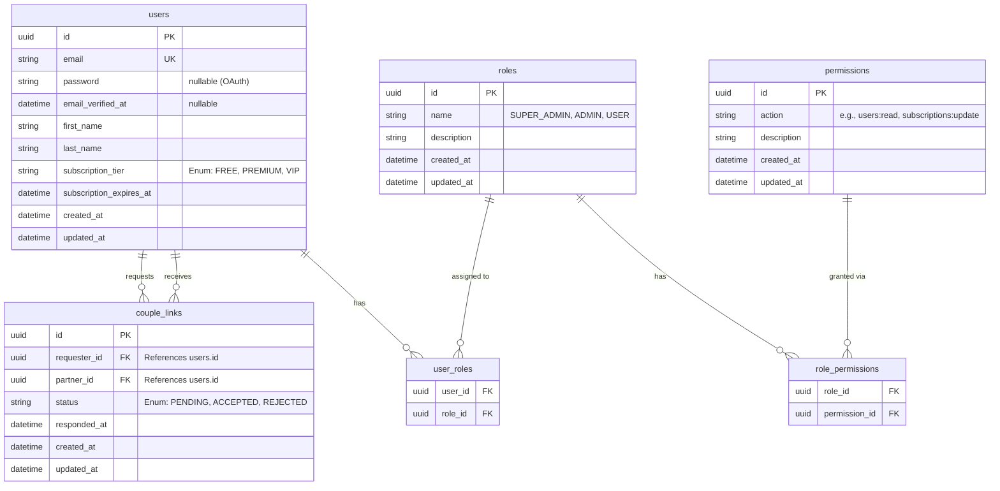

# Rencana Implementasi Authentication, IAM (RBAC), dan Akun Pasangan

Dokumen ini berisi rancangan dan langkah-langkah implementasi sistem otentikasi menggunakan **Limen** (sebuah library otentikasi Go yang modern, *plugin-first*, dan terinspirasi dari `better-auth`), beserta desain struktur Role-Based Access Control (RBAC) bergaya IAM (AWS) dan fitur "Akun Pasangan" (Couple Account).

---

## 1. Arsitektur Otentikasi (Limen) + OpenAPI Contract-First

Kita mengadopsi pendekatan **Contract-First API**. Artinya, sumber kebenaran (Source of Truth) untuk seluruh endpoint API adalah spesifikasi OpenAPI (`api/openapi.yaml`).

```text
                 API CONTRACT
                      │
              ┌───────▼───────┐
              │   OpenAPI     │
              │   schema      │
              └───────┬───────┘
                      │
          ┌───────────┼────────────┐
          ▼           ▼            ▼
      Go Server    Swagger UI   TypeScript
    oapi-codegen                generated
          │
          ▼
       Bruno
    API test cases
          │
          ▼
    Integration Tests
```

Limen bertugas menangani hal-hal fundamental seperti Session Management, Cookies, CSRF, dan eksekusi login/register. Arsitektur eksekusi menjadi:
```text
                     Google (OAuth)
                       │
                       ▼
                    Limen (Go)
                       │
                       ▼
Next.js ────────► Go Backend Server
                     │
       ┌─────────────┼──────────────┐
       │             │              │
      Auth         Wedding         Guest
       │             │              │
       └─────────────┴──────────────┘
                     │
                     ▼
                 PostgreSQL
```

Limen beroperasi secara independen di Go, dan endpointnya diekspos (misal `/api/auth/*`) melalui Go router (Gin).

---

## 2. Struktur Database Lengkap (ER Diagram)

Berikut adalah desain relasi database (Entity Relationship) lengkap yang mencakup kebutuhan Auth, IAM, dan Akun Pasangan, dimodelkan dengan GORM di `internal/models/models.go`:



> **Note:** Tabel `sessions` di-manage secara native oleh Limen (beserta plugin adapter GORM-nya). Tabel `users` di-share antara sistem kita dengan Limen. 

---

## 3. Desain "Akun Pasangan" (Couple Linking)

**Alur Bisnis Pasangan:**
1. User A mengirim invite ke User B (berdasarkan email). Endpoint `POST /api/couples/invitations`.
2. Data masuk ke `couple_links` dengan status `PENDING`.
3. User B menerima notifikasi/melihat daftar undangan (Endpoint `GET /api/couples/invitations`) dan menekan "Terima" (`POST /api/couples/invitations/{id}/accept`).
4. Status berubah menjadi `ACCEPTED`.
5. Pada layer *Repository* atau *Business Logic* yang berkaitan dengan entitas *wedding* selanjutnya, setiap query dibungkus filter: `WHERE user_id = ? OR user_id = ?` (mengambil relasi dari pasangan yang aktif).

---

## 4. Middleware & Validasi (IAM Guard)

Middleware dikelola di Go, dan diterapkan pada logic yang berada di *stub* atau handler yang di-*generate* oleh `oapi-codegen`:

1. **Auth Check (`AuthMiddleware`):** Membaca request -> divalidasi oleh Limen (`GetSession`). Jika valid, userID dimasukkan ke dalam `gin.Context`.
2. **IAM Check (`RequirePermission`):** Mengecek apakah user memiliki hak akses terhadap *action* (berbasis table `role_permissions`). Jika tidak, HTTP 403 Forbidden.
3. **Subscription Check:** Validasi *tier* (Free vs Premium) untuk membatasi fungsionalitas aplikasi di masa mendatang.

---

## 5. Step-by-Step Pengerjaan (Implementation Steps)

Langkah-langkah yang **sudah** dan **akan** kita kerjakan:

- [x] **Langkah 1: Setup Kontrak (OpenAPI)**
  - Pembuatan `api/openapi.yaml` dengan Contract-First.
  - Setup code generation `oapi-codegen`.
- [x] **Langkah 2: Setup Database & Limen**
  - Pembuatan file `internal/db/db.go` (GORM connection).
  - Setup Limen di `internal/auth/auth.go` dengan `credential-password` dan GORM adapter.
  - Pembuatan GORM Models di `internal/models/` yang sesuai dengan ERD di atas.
  - Wiring dependencies di `cmd/server/main.go` dan menjalankan `models.Migrate(db)`.
- [x] **Langkah 3: Implementasi Handler (Business Logic)**
  - Profile: `internal/api/profile.go`, Couple Links: `internal/api/couples.go`, IAM Admin: `internal/api/admin.go`.
  - Auth & permission check per-handler via `Server.authorize(c, "<permission>")` (Limen session + RBAC lookup).
- [x] **Langkah 4: Seeding Data (RBAC)**
  - `internal/db/seeder.go` (`SeedRolesAndPermissions`) dijalankan otomatis & idempotent saat startup.
- [ ] **Langkah 5: Pengujian Terintegrasi (Bruno / E2E)**
  - Coba integrasi Auth, pendaftaran akun, dan relasi couple dengan tool API Client seperti Bruno atau cURL.
