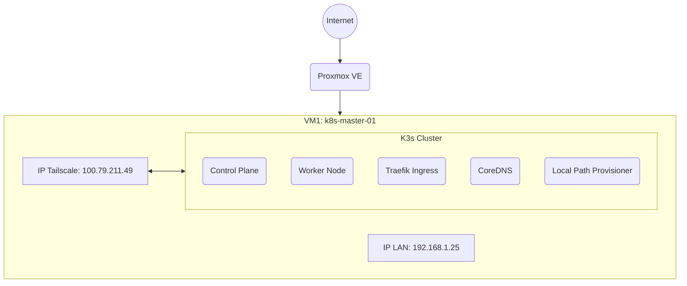
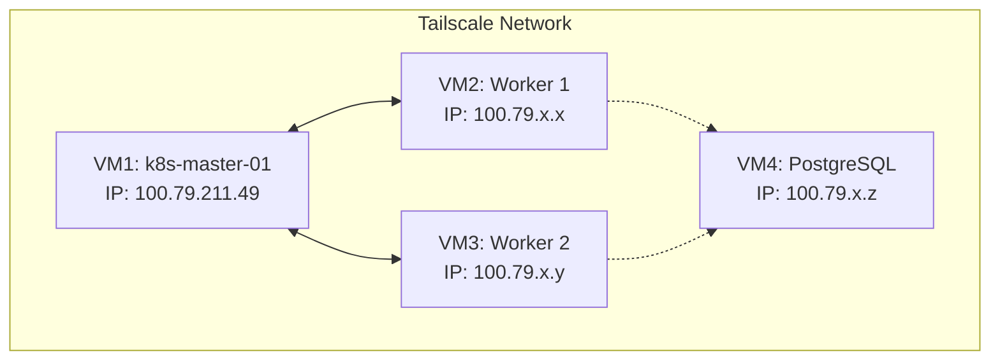

# Kubernetes Infrastructure Architecture

## Current State (Tahap 1)

Infrastruktur tahap awal ini berjalan di atas sebuah Proxmox VM yang difungsikan sebagai K3s single-node cluster (menggabungkan peran Control Plane dan Worker dalam satu node).

### Keputusan Desain
1. **Networking:** Node Kubernetes (kubelet) dipaksa untuk *bind* dan berkomunikasi menggunakan IP Tailscale (`100.79.211.49`) dengan argumen `--node-ip=100.79.211.49` dan `--flannel-iface=tailscale0`. Ini memastikan komunikasi antar node K3s nantinya sepenuhnya aman melalui *tunnel* Tailscale, bukan melalui jaringan Proxmox lokal (`192.168.1.x`).
2. **Container Runtime:** K3s menggunakan *embedded* `containerd`. Docker yang sudah ada di OS akan diabaikan dan dibiarkan menyala agar tidak merusak fungsi lama.
3. **Storage:** Menggunakan bawaan K3s (`local-path-provisioner`) memanfaatkan sisa *disk* 957 GB.
4. **Ingress:** Menggunakan bawaan K3s (Traefik).

---

## Future State (Multi-Node)

Desain ini sudah disiapkan menggunakan Ansible agar penambahan Worker Node di masa depan sangat mudah dan tidak perlu merombak ulang Master Node.

### Cara Scale Out Nanti
1. Buat VM baru di Proxmox.
2. Install Tailscale di VM baru.
3. Tambahkan IP Tailscale VM baru tersebut ke file `ansible/inventory/hosts.yml` pada blok `k3s_workers`.
4. Jalankan `ansible-playbook playbooks/k3s-worker.yml`.
5. Worker baru akan otomatis terhubung ke Master melalui Tailscale.
